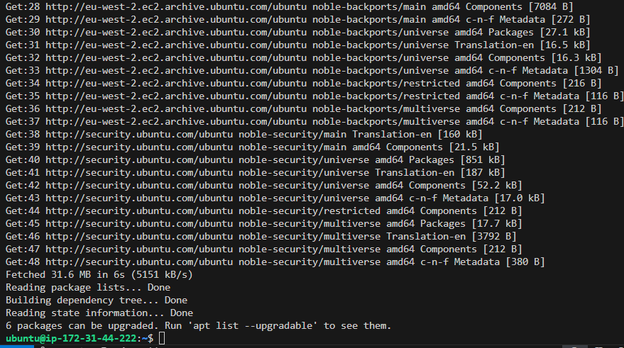

# LEMP-STACK IMPLEMENTATION
### Building the Foundation and Setting Up the Web Server
This chapter focuses on preparing the base of the LEMP stack, the Ubuntu server hosted on AWS EC2 and the Nginx web server.
This project focused on deploying and configuring a LEMP stack, a set of open-source software used to serve dynamic web pages and applications. 
The acronym LEMP stands for:
- Linux (operating system)
- Nginx (web server, pronounced "Engine-X")
- MySQL (database management system)
- PHP (server-side scripting language)

This project builds on previous knowledge from [Project 1](https://github.com/Valcupertino/Project1-Lamp-Stack) (where we used Apache instead of Nginx) and introduces [Nginx](https://nginx.org/en/) as a high-performance web server alternative, widely used in production environments.
But let's always remember to make self study on 
1. [SQL syntax](https://www.w3schools.com/sql/sql_syntax.asp)
2. [Nano editor](https://www.nano-editor.org/) and know basic Nano commands as well.

So the first step here is to login into a web server, and in this project we are using AWS server. When you must have logged in, make sure to maitain same region, then you go to instances and create EC2 instances, by selecting your perm key and the free tier, then click on connect, choosing ubuntu server. 

When you click the connect, you will see SSH code pop-up, that's what you would copy and run it on your VScode so as to gain access to your server through you WSL. Here's what the code look like:
```
ssh -i <Your-private-key.pem> ubuntu@<EC2-Public-IP-address>
```
When you are into the serve, your WSL will change from your name to **ubuntu**, now you have access and can run your command on WSL to reflect on yor web browser. 

Now let's take this step by step, we will install Nginx, mysql and php.

### Step 1- Installing Nginx Web Server

As we said earlier that Nginx is a high-perfomance web serve, we will use the `apt` pack manager to install this package.
Remember to alsways update your system by using this command
```
sudo apt update
```

After that then install nginx by using this command
```
sudo apt install nginx
```

Enter Y when prompted as installation confirmation. After this, the Nginx server will be active and running on your Ubuntu server.

Run the following command to verify that nginx was successfully insatalled and running as a service in Ubuntu:
```
sudo systemctl status nginx
```


If it is green and running, then you did everything correctly - you have just launched your first Web Server in the Clouds!
Before we can receive any traffic by our Web Server, we need to open TCP port 80 which is default port that web brousers use to access web pages in the Internet.

As we know, we have TCP port 22 open by default on our EC2 machine to access it via SSH, so we need to add a rule to EC2 configuration to open inbound connection through port 80:
- Select _security_ and click on _security groups_

- Select the _Inbound rules_ and click on the _Edit Inbound rules_

- Click on the 'Add rule' and from the box, click the drop down arrow and change it from _custom_ to _HTTP_ and also select 'Anywhere'

- After that, then save rules


Now our server is running and we can access it locally and from the Internet (Source 0.0.0.0/0 means 'from any IP address').

By running this ***curl*** command, we can see to access it locally in our ubuntu: 
```
curl http://127.0.0.1:80
or
curl http://localhost:80
```

After running the curl command, you will see to know you are still on track

When you finish setting it up, you'll see a confirmation to show you have done it well. 

So you can see that even if you don't specify the prot as 80, it would still run anyways. The to curl commands does pretty mush same job. 

Testing how our Nginx serve can respond to requests from the internet, we open a web browser and visit your public IP adress on port 80.
```
http://<Public-IP-Address>:80
```
You can check which IP address with this command; 
```
curl -4 icanhazip.com
```
The URL in browser shall also work if you do not specify port number since all web browsers use port 80 by default.
You will see following page, to be sure your web server is now correctly installed and accessible through your firewall.


This is the screenshot of what you'll see on the web browser, which is still same content that you previously got by the 'curl' commad, but now represented in a formmatting way of [HTML](https://en.wikipedia.org/wiki/HTML)

**Learning Outcome:**
In this chapter, I learned how to provision a virtual server using AWS EC2 and install core software components using the `apt` package manager. I also gained hands-on experience with configuring the firewall to allow HTTP traffic, starting and verifying the Nginx web server, and understanding how browsers and CLI tools like `curl` interact with web servers over port 80. This foundational setup enabled me to establish a functioning web environment in the cloud.

_Now we will move ove to the installation of 'Mysql' in the next chapter_.
