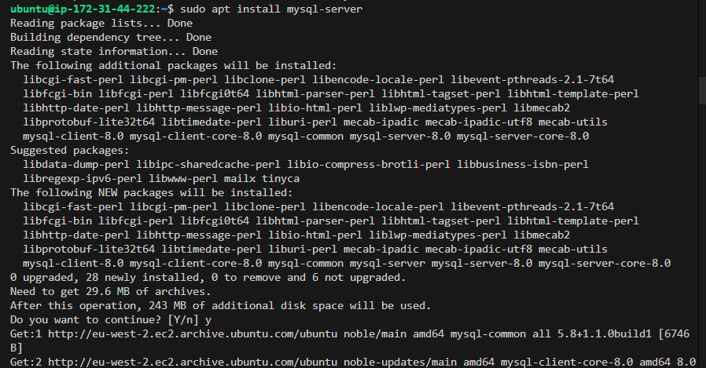
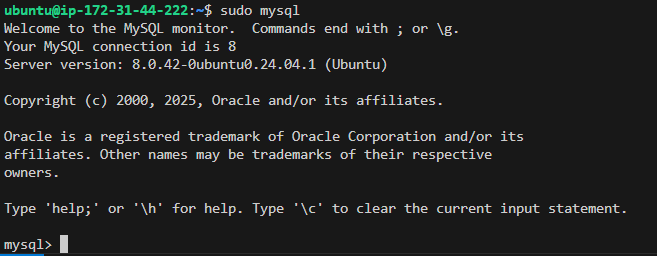
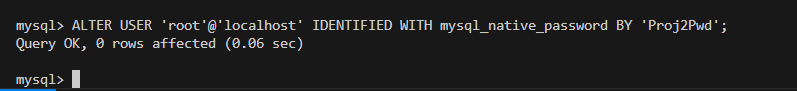
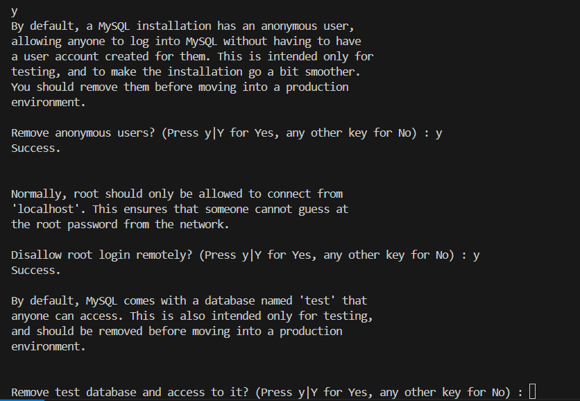

# Storing the Data ,Installing and Securing MySQL

This chapter introduced MySQL, the database engine in the LEMP stack, used to store, organize, and retrieve structured data.

**By the end of this chapter, we must have don the following:**

- Installing MySQL Server using apt.

- Accessing the MySQL shell and executing SQL commands.

- Changing the root authentication method to mysql_native_password.

- Running mysql_secure_installation to enforce best security practices.

- Understanding MySQL privileges and secure user creation.

### Installing MySQL
So, from our chapter 1, we've successfully creayed and logged into a web server that is up an running, so now we need to install a  [Database Management System (DBMS)](https://en.wikipedia.org/wiki/Database#Database_management_system) to be able to store and manage data for your site in a relational database. MySQL is a popular relational database management system used within PHP environments, so we will use it in our project.

Use the `apt` command to install this software
```
sudo apt install mysql-server
```
When prompted, confirm installation by typing `Y`, and then `ENTER`



When the installation is finished, log in to the MySQL console using this command:

```
sudo mysql
```
This will connect to the MySQL server as the administrative database user root, which is inferred by the use of sudo when running this command. An output like this shows up:



Then by running a security script that comes pre-installed with MySQL, it will remove some insecure default settings and lock down access to your database system. Before running the script set a password for the root user, using mysql_native_password as default authentication method. We’re defining this user’s password as `Proj2Pwd`.
To know that you are on track, this is what to see on the screen


Now we exit MySQL shell by just typing 
```
exit
``` 
befor we start an interactive script using this commang:
```
sudo mysql_secure_installation
```
This will ask if you want to configure the `VALIDATE PASSWORD PLUGIN`.

Note that you should be sure before enabling, because if enabled, passwords which don’t match the specified criteria will be rejected by MySQL with an error. It is safe to leave validation disabled, but you should always use strong, unique passwords for database credentials.

after that, answer `Y` for yes, or anything else to continue without enabling.

By answering “yes”, you’ll be asked to select a level of password validation. knowing that if you enter 2 for the strongest level, you will receive errors when attempting to set any password which does not contain numbers, upper and lowercase letters, and special characters, or which is based on common dictionary words and in this project we used this strong one `PassWord.1`.
```
There are three levels of password validation policy:

LOW    Length >= 8
MEDIUM Length >= 8, numeric, mixed case, and special characters
STRONG Length >= 8, numeric, mixed case, special characters and dictionary              file

Please enter 0 = LOW, 1 = MEDIUM and 2 = STRONG: 1
```
For the rest of the questions, press `Y` and hit the `ENTER` key at each prompt. This will prompt you to change the root password, remove some anonymous users and the test database, disable remote root logins, and load these new rules so that MySQL immediately respects the changes you have made.




After the whole process of typing yes and so on, we test if we’re able to log in to the MySQL console this command:
```
sudo mysql -p
```

Notice the `-p` flag in this command, is there to prompt you for the password used after changing the root user password.

To exit the MySQL console, type:
```
exit
```
**Learning Outcome**:
I developed a solid understanding of SQL basics and database administration, including setting strong passwords, managing users, and securing a database server. I now understand how MySQL integrates into a PHP environment and how to safely manage credentials.

Now our MySQL server is installed and secured. Next, we will install PHP which is the final component in the LEMP stack.