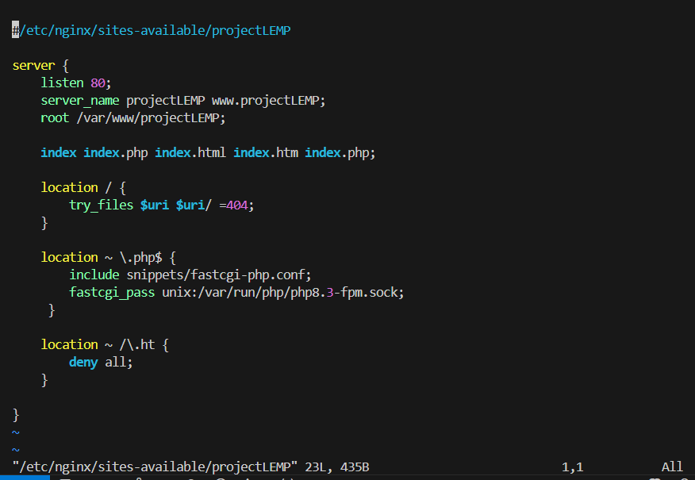
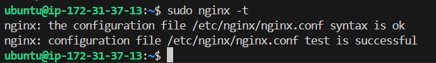
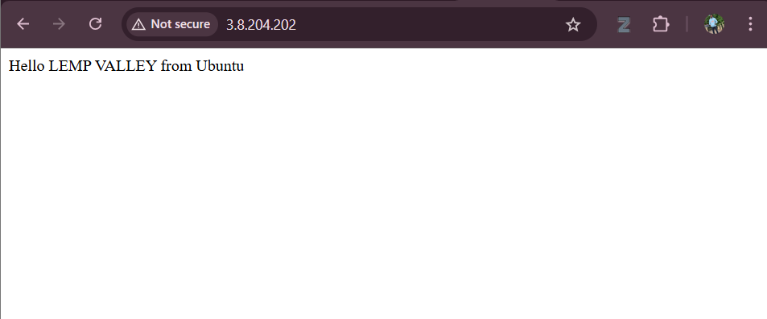

# Installing and Configuring PHP with Nginx

Here in this chapter,the course explained how to make websites interactive by connecting Nginx with PHP, the server-side scripting language.

**By the end of this chapter, we must have don the following:**
- Installing `php-fpm` and `php-mysql` to allow Nginx to process PHP.
- Creating a new server block (virtual host) in `/etc/nginx/sites-available/`.
- Understanding important Nginx directives: `listen`, `server_name`, `root`, `index`, and `location`.
- Creating a custom site root in `/var/www/projectLEMP`.
- Testing PHP integration by creating an `info.php` file.
- Disabling the default site and reloading Nginx to apply new configurations.

### Installing PHP

After we have Nginx installed to serve the content and MySQL installed to store and manage every data. Now we install PHP to process code and generate dynamic content for the web server.

While Apache embeds the PHP interpreter in each request, Nginx requires an external program to handle PHP processing and act as a bridge between the PHP interpreter itself and the web server. This allows for a better overall performance in most PHP-based websites, but it requires additional configuration. You’ll need to install `php-fpm`, which stands for “PHP fastCGI process manager”, and tell Nginx to pass PHP requests to this software for processing. Additionally, you’ll need `php-mysql`, a PHP module that allows PHP to communicate with MySQL-based databases. Core PHP packages will automatically be installed as dependencies.

To install these 2 packages at once, run this command:

```
sudo apt install php-fpm php-mysql
```

When prompted, type `Y` for Yes and press ENTER to confirm installation.

You we have PHP components installed. Next, we'll configure Nginx to use them.


### Configuring Nginx to Use PHP Processor

Nginx uses **server blocks** (similar to Apache's virtual hosts) to manage multiple websites on a single server. By default, Ubuntu configures Nginx to serve content from `/var/www/html`. However, for better organization especially when hosting multiple sites—it's best to create a separate directory under `/var/www` (e.g., `/var/www/your_domain`) for each site, while keeping the default directory unchanged for fallback purposes. In this guide, we will use **LEMPproject** as an example domain name

Run this code to create the root web directory:

```
sudo mkdir /var/www/projectLEMP
```

By assigning ownership of the directory with the $USER environment variable, run this command:

```
sudo chown -R $USER:$USER /var/www/projectLEMP
```
Then, open a new configuration file in Nginx’s *sites-available* directory using your preferred command-line editor. We can use `nano` here, we’ll use `vim` command:

```
sudo vim /etc/nginx/sites-available/projectLEMP
```

This will create a new blank file,then paste in the following bare-bones configuration:

```
#/etc/nginx/sites-available/projectLEMP

server {
    listen 80;
    server_name projectLEMP www.projectLEMP;
    root /var/www/projectLEMP;

    index index.php index.html index.htm index.php;

    location / {
        try_files $uri $uri/ =404;
    }

    location ~ \.php$ {
        include snippets/fastcgi-php.conf;
        fastcgi_pass unix:/var/run/php/php8.3-fpm.sock;
     }

    location ~ /\.ht {
        deny all;
    }

}
```




- `listen` — Defines what port Nginx will listen on. In this case, it will listen on port 80, the default port for HTTP.
- `root` — Defines the document root where the files served by this website are stored.
- `index` — Defines in which order Nginx will prioritize index files for this website. It is a common practice to list index.html files with a higher precedence than index.php files to allow for quickly setting up a maintenance landing page in PHP applications. You can adjust these settings to better suit your application needs.
`server_name` — Defines which domain names and/or IP addresses this server block should respond for. Point this directive to your server’s domain name or public IP address.
`location /` — The first location block includes a try_files directive, which checks for the existence of files or directories matching a URI request. If Nginx cannot find the appropriate resource, it will return a 404 error.
`location ~ \.php$` — This location block handles the actual PHP processing by pointing Nginx to the fastcgi-php.conf configuration file and the php7.4-fpm.sock file, which declares what socket is associated with php-fpm.
`location ~ /\.ht` — The last location block deals with .htaccess files, which Nginx does not process. By adding the deny all directive, if any .htaccess files happen to find their way into the document root ,they will not be served to visitors.

After editing, we save and close the file. As we used `vim`, we exit the page with this command: `esc+:wq!` if you used `nano` command, you can exit by typing CTRL+X and then y and ENTER to confirm.

Activate the configuration by linking to the config file from Nginx’s `sites-enabled` directory, use this command:

```
sudo ln -s /etc/nginx/sites-available/projectLEMP /etc/nginx/sites-enabled/
```

This will tell Nginx to use the configuration next time it is reloaded. 
Now, testing he configuration for syntax errors by running this command:

```
sudo nginx -t
```
We shall see following message:



If any errors are reported, go back to your configuration file to review its contents before continuing.

We also need to disable default Nginx host that is currently configured to listen on port 80, for this run this command:

```
sudo unlink /etc/nginx/sites-enabled/default
```
After that, reload Nginx to apply the changes:

```
sudo systemctl reload nginx
```
Your new website is now active, but the web root `/var/www/projectLEMP` is still empty. So we create an `index.html` file in that same location so that we can test that the new server block works as expected by running this command:

```
sudo echo "Hello LEMP VALLEY from Ubuntu" >> /var/www/projectLEMP/index.html
```
After that, we go to the browser and try to open the website URL using IP address:

```
http://<Public-IP-Address>:80
```
Or you an directly open you public IP address on your browser, on `Port-80`. You will then see it display on your web browser as seen below



**Note**: You can leave this file in place as a temporary landing page for your application until you set up an index.php file to replace it. Once you do that, remember to remove or rename the `index.html` file from your document root, as it would take precedence over an index.php file by default.

Our LEMP stack is now fully configured. In the next step, we’ll create a PHP script to test that Nginx is in fact able to handle `.php` files within our newly configured website.