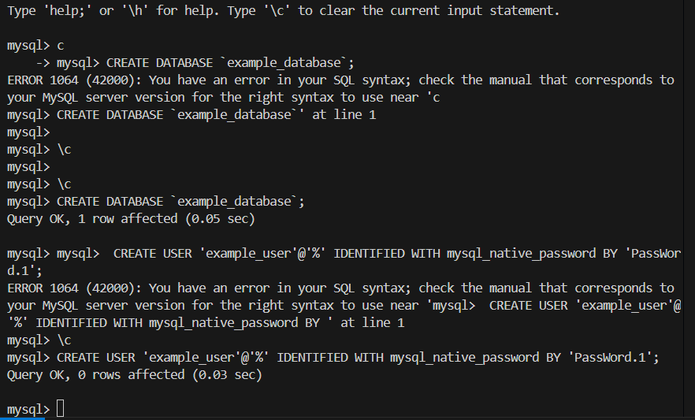
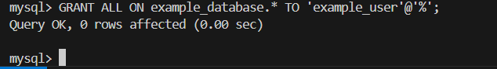
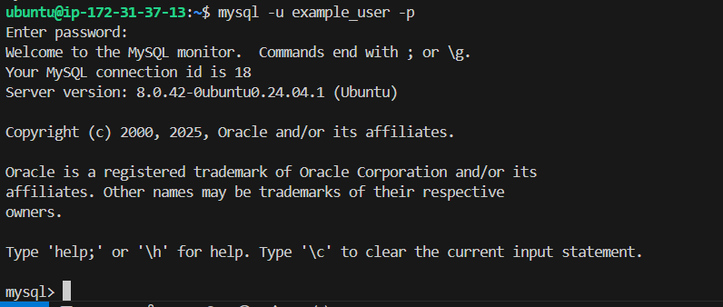
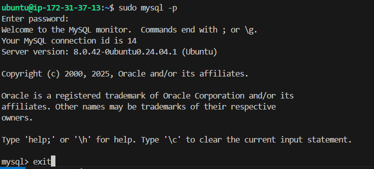
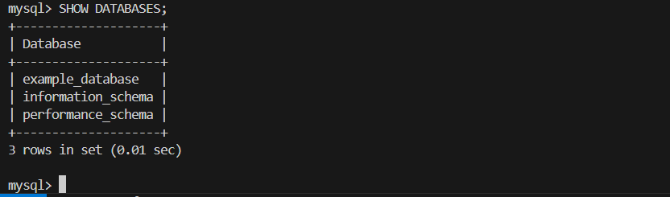
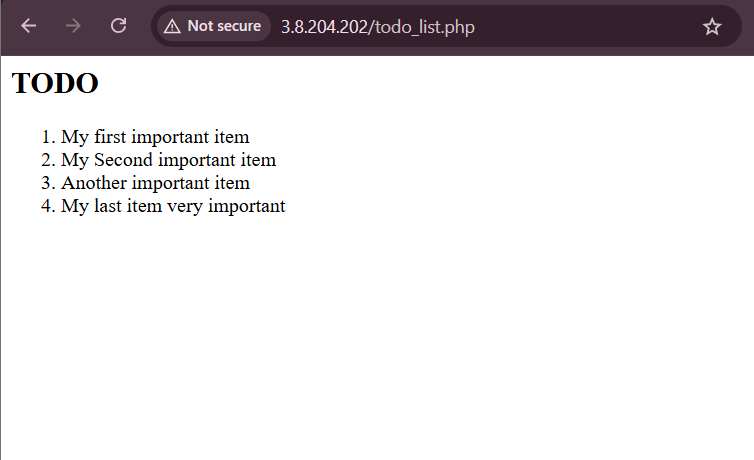

# PHP and MySQL Integration
The final chapter, we focus on full-stack integration by querying MySQL from PHP and displaying results on a web page, completing the LEMP architecture.

**By the end of this chapter, we must have don the following:**

- Created a database: `example_database` and a user `example_user` with full privileges.
- Created a table `todo_list` and inserted sample data using SQL commands.
- Developed a PHP script `todo_list.php` that:  
--- Connects to the database via PDO.
--- Executes a SELECT query to retrieve and display items.
--- Displays data in a formatted HTML `ol` list.
- Tested output by accessing the script through a web browser using public IP.

### Testing PHP with Nginx

As our LEMP-STACK is now completely set up and installed, in full operation, we test it to validate that Nginx can correctly hand `.php` files off to the PHP processor.
We do this by creating a test PHP file in the document root. Open a new file called `info.php` within the document root in the text editor by this `vim`command:

```
vim /var/www/projectLEMP/info.php
```

Type or paste the following lines into the new file. This is valid PHP code that will return information about your server:

```
<?php
phpinfo();
```
We now open our public IP address on port-80 as usuall to view this, or
You can access this page in the web browser by visiting the domain name or public IP address you’ve set up in your Nginx configuration file, followed by /info.php. 


When you see the above appear on your web browser, then you know that you are in the right track and everything running perfectly.

After checking the relevant information about the PHP server through that page, it’s best to remove the file created as it contains sensitive information about your PHP environment and your Ubuntu server. You can use `rm` to remove that file as we can always regenerate this file later when it's needed.

```
sudo rm /var/www/your_domain/info.php
```

### Retrieving data from MySQL database with PHP

In this step we create a test database (DB) with simple "To do list" and configure access to it, so the Nginx website would be able to query data from the DB and display it.

At the time of this writing, the native MySQL PHP library mysqlnd doesn’t support caching_sha2_authentication, the default authentication method for MySQL 8. We’ll need to create a new user with the mysql_native_password authentication method in order to be able to connect to the MySQL database from PHP.

We will create a database named example_database and a user named example_user, but you can replace these names with different values.

First, connect to the MySQL console using the root account:

```
sudo mysql -p
```
To create a new database, run the following command from your MySQL console:

```
mysql> CREATE DATABASE `example_database`;
```



Now you can create a new user and grant him full privileges on the database you have just created.

The following command creates a new user named example_user, using mysql_native_password as default authentication method. We’re defining this user’s password as PassWord.1, but you should replace this value with a secure password of your own choosing.

```
CREATE USER 'example_user'@'%' IDENTIFIED WITH mysql_native_password BY 'PassWord.1';
```
Now we need to give this user permission over the example_database database:

```
mysql> GRANT ALL ON example_database.* TO 'example_user'@'%';
```

After this you can exit MySQL by typing 
```
exit
```

You can test if the new user has the proper permissions by logging in to the MySQL console again, this time using the custom user credentials:

```
mysql -u example_user -p
```
The picture below shows its is running correctly



Notice the -p flag in this command, which will prompt you for the password used when creating the example_user user.


After logging in to the MySQL console, confirm that you have access to the example_database database:

```
mysql> SHOW DATABASES;
```
This will give you the following output:

```
Output
+--------------------+
| Database           |
+--------------------+
| example_database   |
| information_schema |
| performance_schema |
+--------------------+
3 rows in set (0.02 sec)
```

Next, we’ll create a test table named todo_list. From the MySQL console, run the following statement:

```
CREATE TABLE example_database.todo_list (item_id INT AUTO_INCREMENT,content VARCHAR(255),PRIMARY KEY(item_id));
```

Insert a few rows of content in the test table. You might want to repeat the next command a few times, using different VALUES:

```
mysql> INSERT INTO example_database.todo_list (content) VALUES ("My first important item");
```
To confirm that the data was successfully saved to your table, run:

```
mysql>  SELECT * FROM example_database.todo_list;
```

You’ll see the following output:

```
Output
+---------+-------------------------+
| item_id | content                 |
+---------+-------------------------+
|       1 | My first important item |
|       2 | My second importantitem
       3  |Another important item
       4   My last item very important
+---------+-------------------------+
4 rows in set (0.00 sec)
```
After confirming that you have valid data in your test table, you can exit the MySQL console:

```
exit
```
After that we create a PHP script that will connect to MySQL and query for your content. Create a new PHP file in your custom web root directory using your preferred editor. We’ll use vim for that:

```
vim /var/www/projectLEMP/todo_list.php
```
The following PHP script connects to the MySQL database and queries for the content of the todo_list table, displays the results in a list. If there is a problem with the database connection, it will throw an exception.

Copy this content into your `todo_list.php` script:

```
<?php
$user = "example_user";
$password = "PassWord.1";
$database = "example_database";
$table = "todo_list";

try {
  $db = new PDO("mysql:host=localhost;dbname=$database", $user, $password);
  echo "<h2>TODO</h2><ol>";
  foreach($db->query("SELECT content FROM $table") as $row) {
    echo "<li>" . $row['content'] . "</li>";
  }
  echo "</ol>";
} catch (PDOException $e) {
    print "Error!: " . $e->getMessage() . "<br/>";
    die();
}
```
Save and close the file when you are done editing using `esc+:wq!`

We now access this page in the web browser by visiting the domain name or public IP address configured for your website, followed by `/todo_list.php:`

```
http://<Public_domain_or_IP>/todo_list.php http://35.172.215.47/todo_list.php 
```
Then the following page appears, showing the content we’ve inserted in the test table:



That means our PHP environment is ready to connect and interact with MySQL server.

**Learning Outcome**
I successfully brought together all elements of the LEMP stack: `Linux`, `Nginx`, `MySQL`, and `PHP`, to build a functional web application. I now understand how PHP scripts interact with databases and how to query and present data to the end-user in a dynamic way.