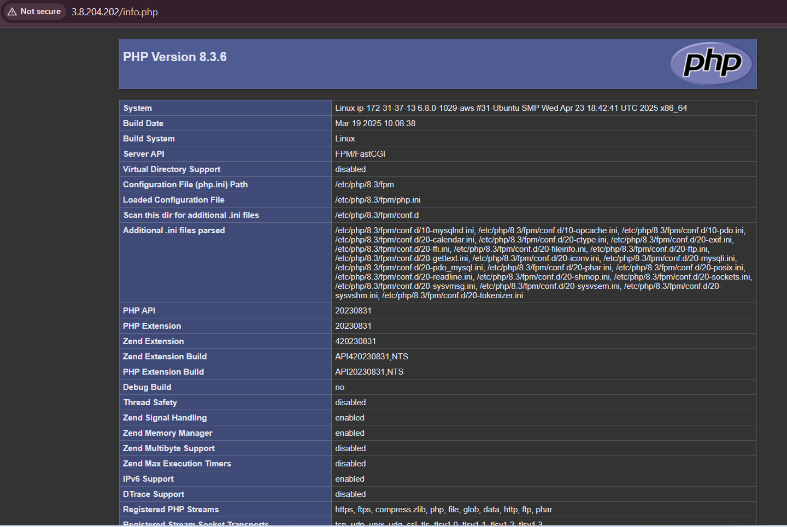
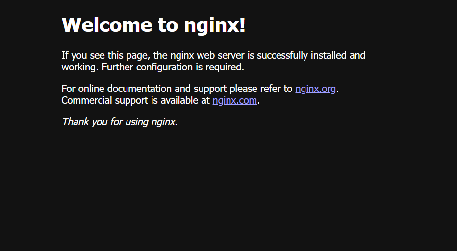

# PHP and MySQL Integration
The final chapter, we focus on full-stack integration by querying MySQL from PHP and displaying results on a web page, completing the LEMP architecture.

**By the end of this chapter, we must have don the following:**

- Created a database: `example_database` and a user `example_user` with full privileges.
- Created a table `todo_list` and inserted sample data using SQL commands.
- Developed a PHP script `todo_list.php` that:  
--- Connects to the database via PDO.
--- Executes a SELECT query to retrieve and display items.
--- Displays data in a formatted HTML `ol` list.
- Tested output by accessing the script through a web browser using public IP.

### Testing PHP with Nginx

As our LEMP-STACK is now completely set up and installed, in full operation, we test it to validate that Nginx can correctly hand `.php` files off to the PHP processor.
We do this by creating a test PHP file in the document root. Open a new file called `info.php` within the document root in the text editor by this `vim`command:

```
vim /var/www/projectLEMP/info.php
```

Type or paste the following lines into the new file. This is valid PHP code that will return information about your server:

```
<?php
phpinfo();
```
We now open our public IP address on port-80 as usuall to view this, or
You can access this page in the web browser by visiting the domain name or public IP address you’ve set up in your Nginx configuration file, followed by /info.php. 



When you see the above appear on your web browser, then you know that you are in the right track and everything running perfectly.

After checking the relevant information about the PHP server through that page, it’s best to remove the file created as it contains sensitive information about your PHP environment and your Ubuntu server. You can use `rm` to remove that file as we can always regenerate this file later when it's needed.

```
sudo rm /var/www/your_domain/info.php
```

### Retrieving data from MySQL database with PHP

In this step we create a test database (DB) with simple "To do list" and configure access to it, so the Nginx website would be able to query data from the DB and display it.

At the time of this writing, the native MySQL PHP library mysqlnd doesn’t support caching_sha2_authentication, the default authentication method for MySQL 8. We’ll need to create a new user with the mysql_native_password authentication method in order to be able to connect to the MySQL database from PHP.

We will create a database named example_database and a user named example_user, but you can replace these names with different values.

First, connect to the MySQL console using the root account:

```
sudo mysql -p
```
To create a new database, run the following command from your MySQL console:

```
mysql> CREATE DATABASE `example_database`;
```

